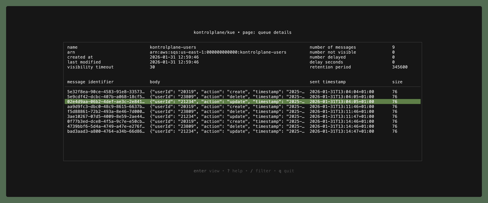
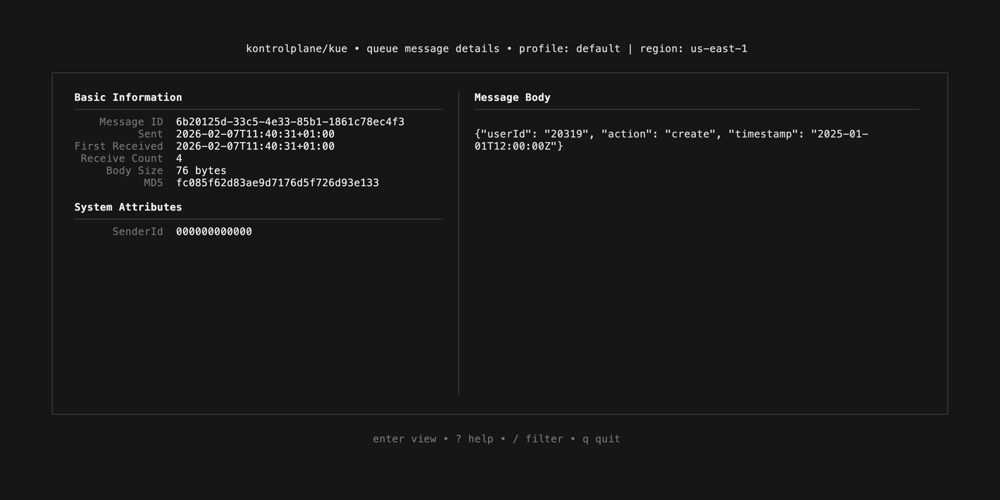
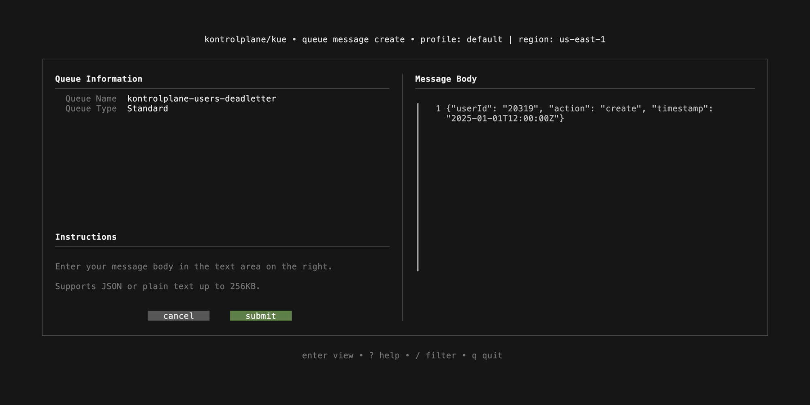
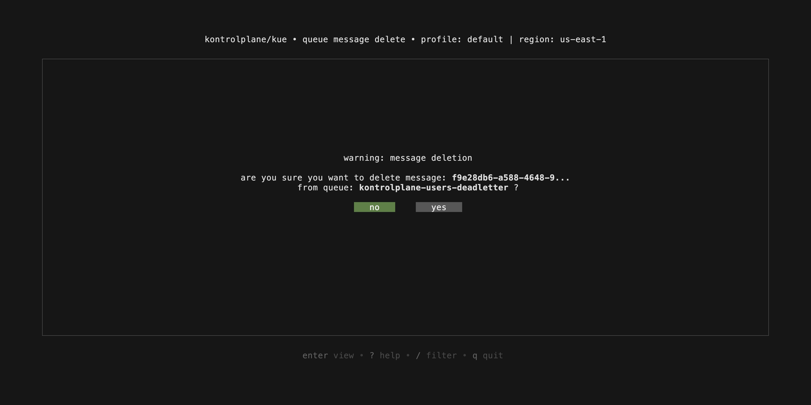
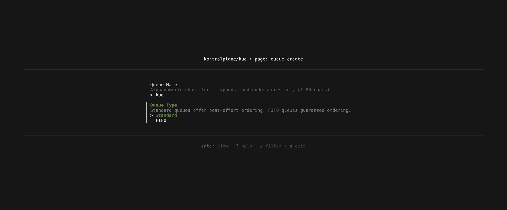
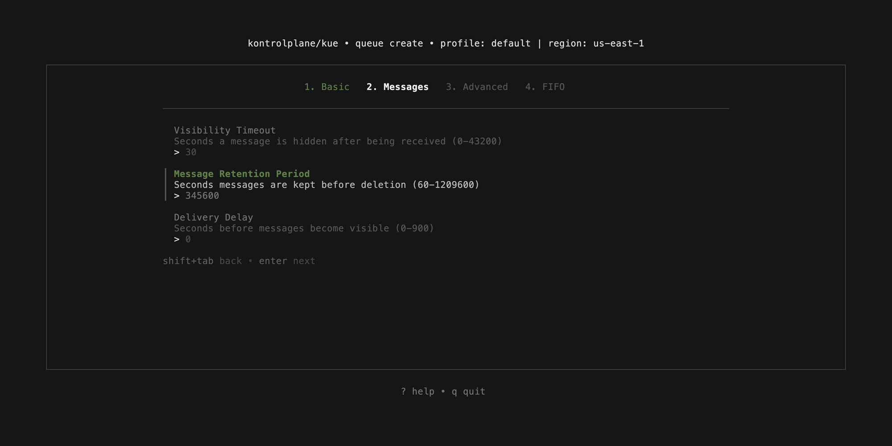
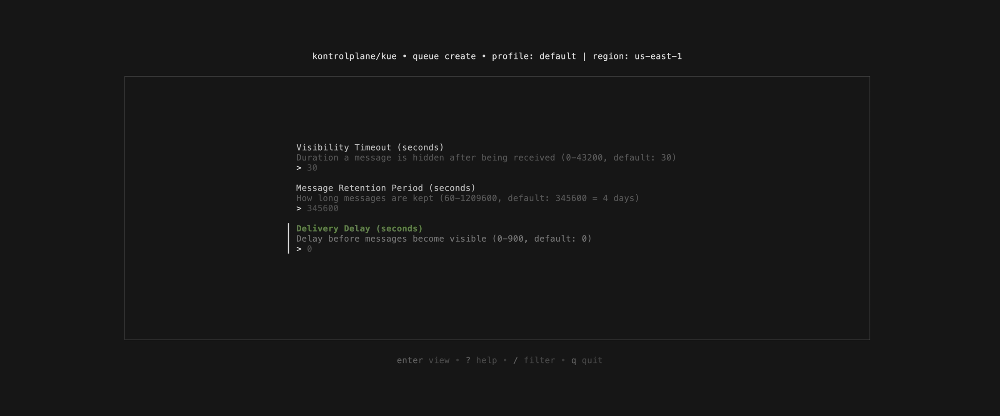
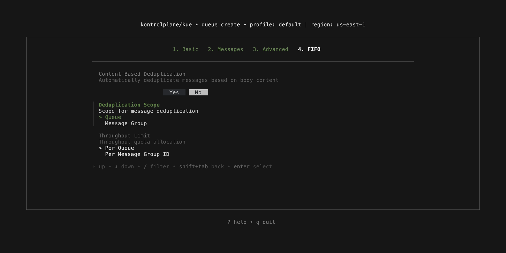

<p align="center">
  <h1 align="center">
    <a href="https://kontrolplane.dev">
      
    </a>
  </h1>
</p>

`Kue` is a terminal user interface (tui) application designed for managing aws sqs (simple queue service). It provides an intuitive and efficient way to interact with your sqs queues directly from the terminal. With Kue, you can easily create, delete, and manage messages within your queues, making it an essential tool for engineers who prefer working within a terminal environment.

<p align="center">
  
</p>

## views

- `queue`: overview, details, creation, delete
- `message`: details, creation, delete

## keybindings

- `q`, `esc`, `ctrl+c`: quit/return
- `↑`, `k`: up
- `↓`, `j`: down
- `→`, `l`: right
- `←`, `h`: left
- `ctrl + d`: delete queue/message
- `ctrl + n`: create queue/message
- `?`: help
- `enter`: view
- `space`: select
- `/`: filter

## demonstration

`queue overview`
<p align="center">
  
</p>

`queue details`
<p align="center">
  
</p>

`message details`
<p align="center">
  
</p>

`message creation`
<p align="center">
  
</p>

`message delete`
<p align="center">
  
</p>

`queue creation`
<p align="center">
  
</p>

<p align="center">
  
</p>

<p align="center">
  
</p>

<p align="center">
  
</p>

`queue delete`
<p align="center">
  
</p>

## development

Kue uses [LocalStack](https://www.localstack.cloud/) running in Docker to simulate AWS SQS locally. This allows you to develop and test without connecting to real AWS services.

- [docker](https://www.docker.com/)
- [localstack](https://www.localstack.cloud/)
- [earthly](https://earthly.dev/)
- [go](https://go.dev/) 1.23+

```bash
docker run --rm -d \
  --name localstack \
  -p 4566:4566 \
  -e SERVICES=sqs \
  localstack/localstack
```

```bash
export AWS_ENDPOINT_URL=http://localhost:4566
export AWS_ACCESS_KEY_ID=default
export AWS_SECRET_ACCESS_KEY=default
export AWS_DEFAULT_REGION=us-east-1
```

The project includes an [Earthfile](./Earthfile) with targets to quickly set up sample SQS queues and messages for development.

**create sample queues**

```bash
earthly +queues
```

**send sample messages**

```bash
earthly +messages
```

To show the changes made in the repository readme, the following command can be ran which automatically creates the preview gif & screenshots:

```bash
earthly +vhs
```

### running kontrolplan/kue locally

After setting up LocalStack and creating sample resources build and run:

```bash
earthly +local && ./build/kontrolplane/kue
```

## contributors

[//]: kontrolplane/generate-contributors-list

<a href="https://github.com/levivannoort"></a>

[//]: kontrolplane/generate-contributors-list

</br>

<p align="center">
  
</p>
