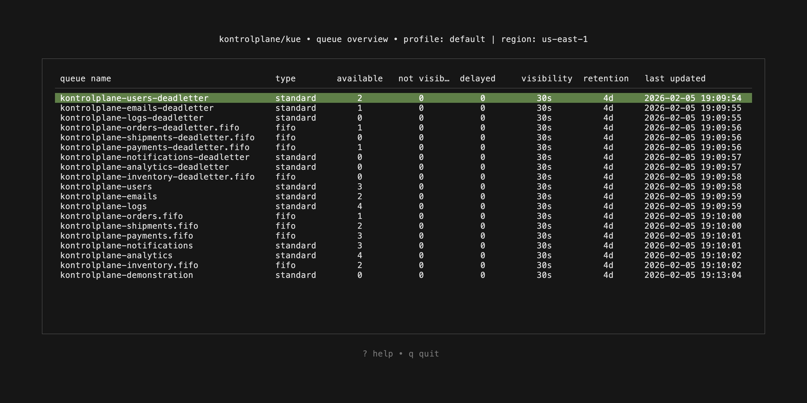
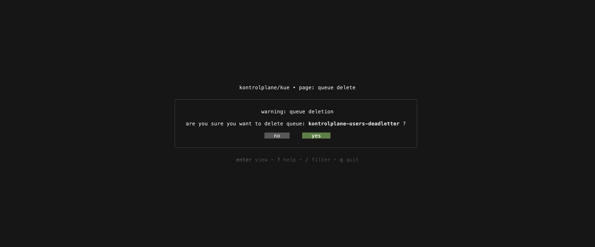

  <h1 align="center">
    
  </h1>

`Kue` is a terminal user interface (tui) application designed for managing aws sqs (simple queue service). It provides an intuitive and efficient way to interact with your sqs queues directly from the terminal. With Kue, you can easily create, delete, and manage messages within your queues, making it an essential tool for engineers who prefer working within a terminal environment.

  

## views

- `queue`: overview, details1, creation1, delete
- `message`: details1, creation1, delete1

1: work in progress

## keybindings

- `q`, `esc`, `ctrl+c`: quit/return
- `↑`, `k`: up
- `↓`, `j`: down
- `→`, `l`: right
- `←`, `h`: left
- `ctrl + d`: delete queue/message
- `ctrl + n`: create queue/message
- `?`: help
- `enter`: view
- `space`: select
- `/`: filter

## demonstration

`queue overview`

  

`queue delete`

  

 

  

