<p align="center">
  <h1 align="center">
    <a href="https://kontrolplane.dev">
      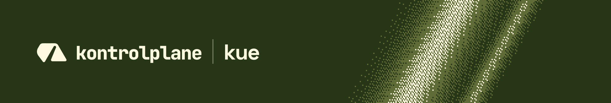
    </a>
  </h1>
</p>

`kue` is a terminal user interface (tui) application designed for managing aws sqs (simple queue service). It provides an intuitive and efficient way to interact with your sqs queues directly from the terminal. With Kue, you can easily create, delete, and manage messages within your queues, making it an essential tool for engineers who prefer working within a terminal environment.

<p align="center">
  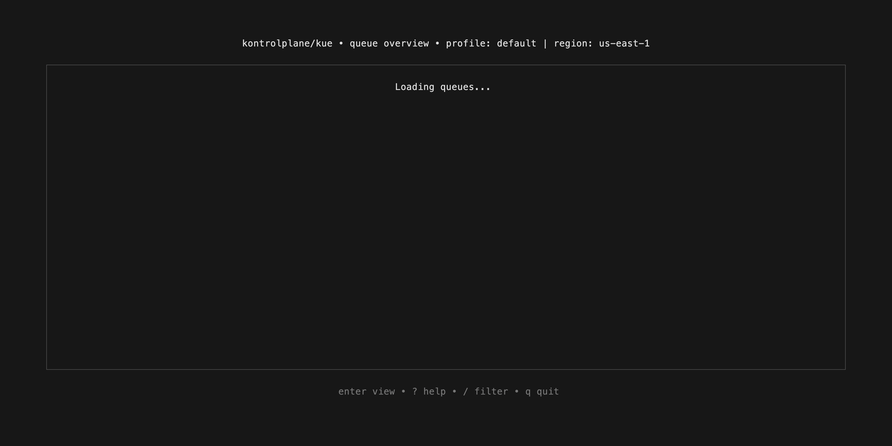
</p>

## views

- `queue`: overview, details, creation, delete, purge, dead-letter redrive
- `message`: details, send, delete

The header shows the aws profile, region, account and endpoint in use, and the number of queues and messages across them.

## keybindings

- `q`: back, quit on the queue overview
- `esc`: back, clear the filter or selection, cancel a dialog or form; never quits
- `ctrl+c`: quit
- `↑`, `k`: up
- `↓`, `j`: down
- `→`, `l`: right
- `←`, `h`: left
- `g`, `G`: first/last row, top/bottom of a message body
- `pgup`, `pgdn`: page up/down
- `tab`, `shift+tab`: next/previous field
- `ctrl+n`: create queue/send message
- `ctrl+d`: delete queue/message
- `ctrl+p`: purge queue
- `ctrl+r`: redrive a dead-letter queue
- `ctrl+s`: send (in the send view)
- `y`, `n`: answer a yes/no dialog
- `c`: copy message body/queue arn
- `r`: refresh, also while paused
- `p`: pause/resume the automatic refresh
- `?`: help
- `enter`: view
- `space`: select
- `/`: filter

Deleting a queue asks to type its name first, and purging a queue with more than 10 messages asks twice. Pressing `esc` on a form with input asks again before discarding it.

## flags

| flag        | description                                                                              |
| ----------- | ---------------------------------------------------------------------------------------- |
| `--theme`   | `auto`, the default, follows the terminal; `dark` and `light` paint their own background |
| `--debug`   | write debug logs to `debug.log`                                                          |
| `--version` | print the version and exit                                                               |
| `--help`    | print the flags and exit                                                                 |

The aws profile, region and endpoint come from the environment and the shared aws config, e.g. `AWS_PROFILE`, `AWS_REGION` and `AWS_ENDPOINT_URL`.

## demonstration

`queue overview`
<p align="center">
  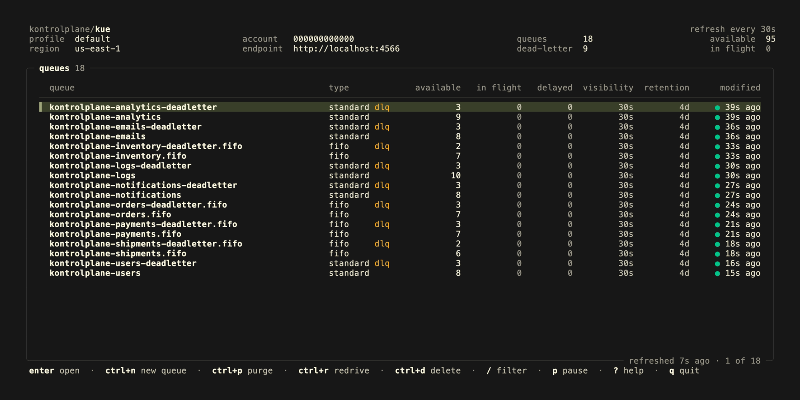
</p>

`queue details`
<p align="center">
  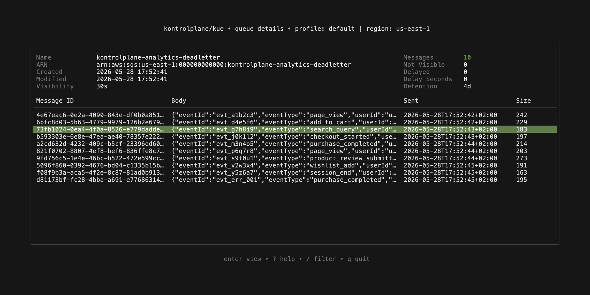
</p>

`message details`
<p align="center">
  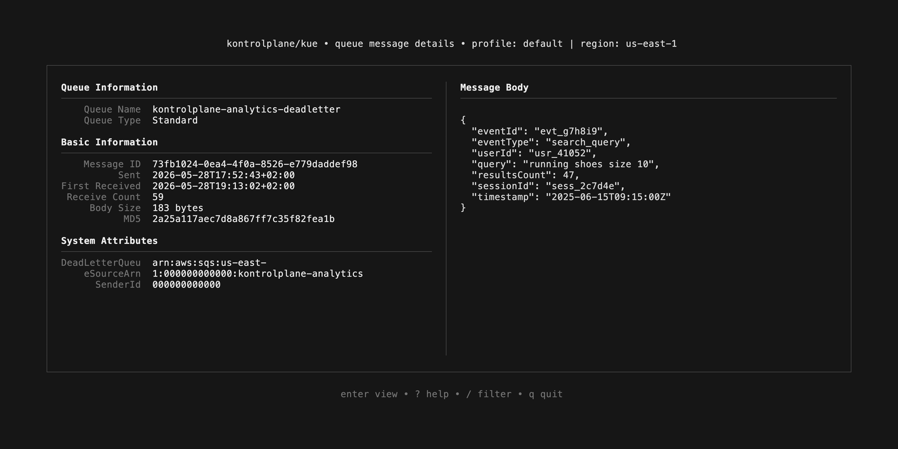
</p>

`message creation`
<p align="center">
  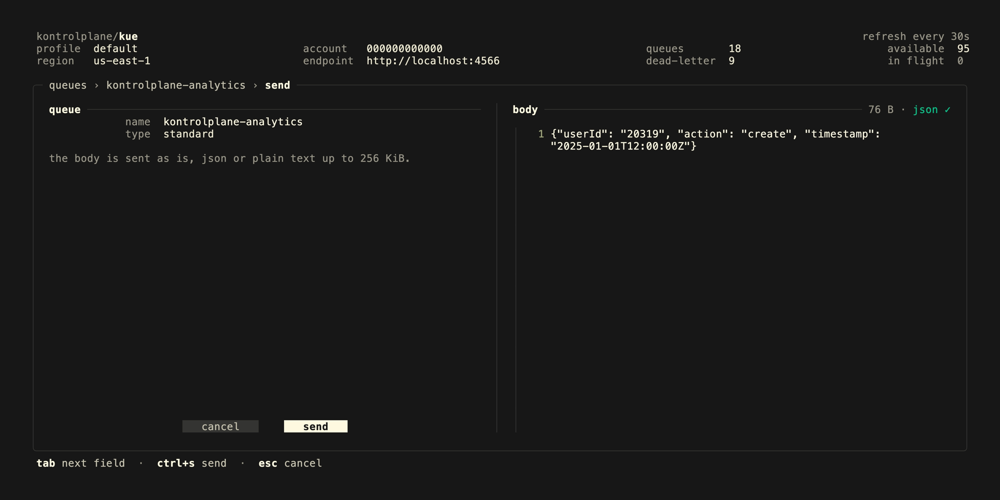
</p>

`message delete`
<p align="center">
  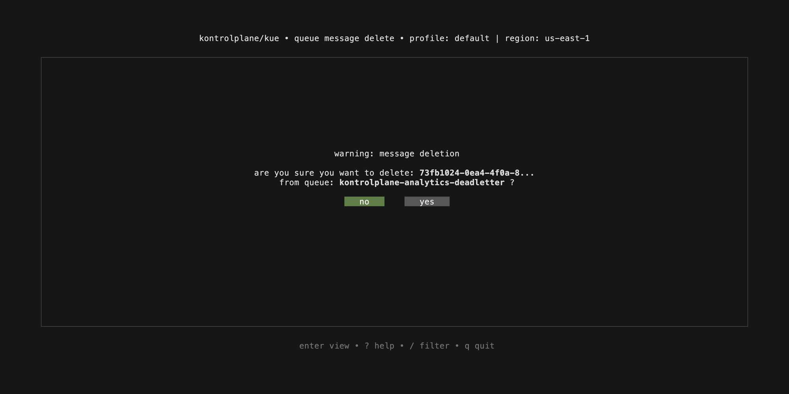
</p>

`queue creation`
<p align="center">
  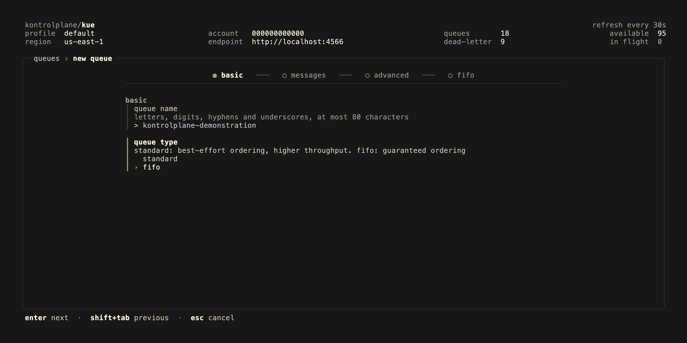
</p>

<p align="center">
  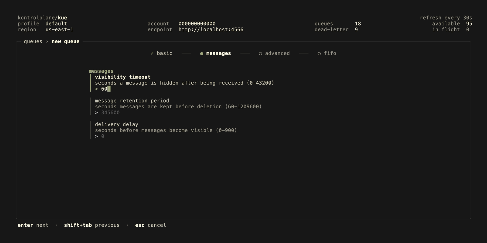
</p>

<p align="center">
  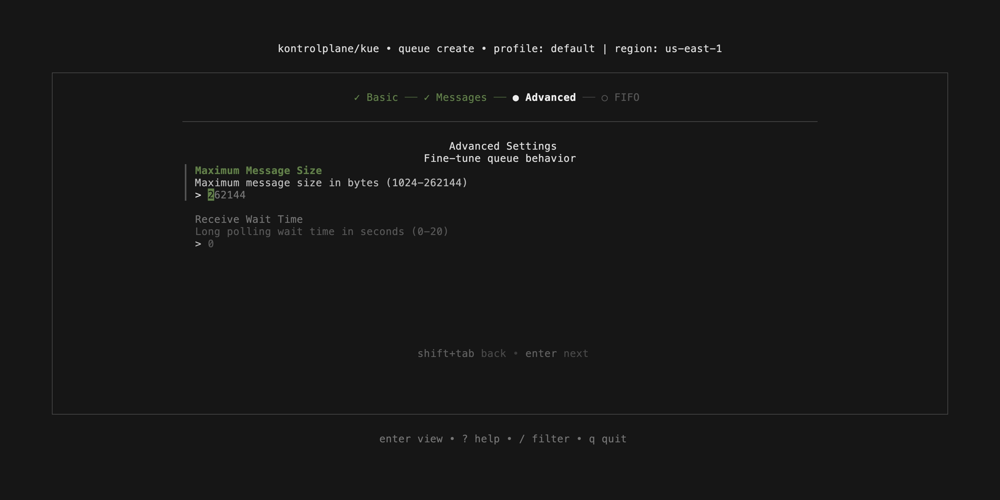
</p>

<p align="center">
  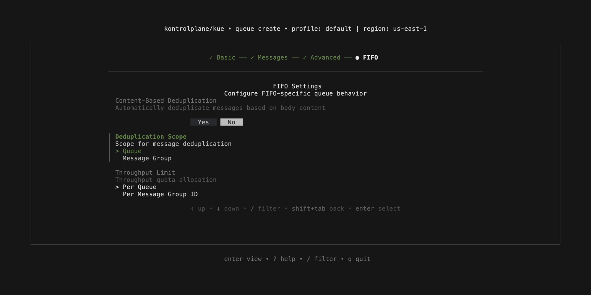
</p>

`queue delete`
<p align="center">
  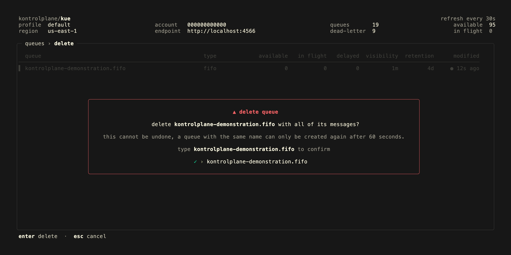
</p>

## development

Kue uses [LocalStack](https://www.localstack.cloud/) running in Docker to simulate AWS SQS locally. This allows you to develop and test without connecting to real AWS services.

- [docker](https://www.docker.com/)
- [aws cli](https://aws.amazon.com/cli/)
- [jq](https://jqlang.org/)
- [earthly](https://earthly.dev/)
- [vhs](https://github.com/charmbracelet/vhs) with `ffmpeg` and `ttyd`, only to record the readme gif and screenshots
- [go](https://go.dev/) 1.26+

```bash
docker compose up -d
```

The compose file pins `localstack/localstack:4.14.0`, the last community release. Later images quit on start without a `LOCALSTACK_AUTH_TOKEN`.

The project includes an [Earthfile](./Earthfile) with targets to quickly set up sample SQS queues and messages for development. They point the aws cli at LocalStack with its `test` credentials, so your own aws profile is never used.

**create sample queues and messages**

```bash
earthly +seed
```

**list the queues**

```bash
earthly +list
```

To show the changes made in the repository readme, the following command can be ran which automatically creates the preview gif & screenshots:

```bash
earthly +vhs
```

### running kontrolplane/kue locally

Start LocalStack, create the sample resources, build and run in one go:

```bash
earthly +dev
AWS_ENDPOINT_URL=http://localhost:4566 AWS_REGION=us-east-1 AWS_ACCESS_KEY_ID=test AWS_SECRET_ACCESS_KEY=test ./build/kontrolplane/kue
```

Seeding skips queues that already exist, so this can be rerun. LocalStack keeps nothing across restarts, so `docker compose restart` starts from scratch.

## contributors

[//]: kontrolplane/generate-contributors-list

<a href="https://github.com/levivannoort"></a>

[//]: kontrolplane/generate-contributors-list

</br>

<p align="center">
  
</p>
